# FPLUS — Constitución Técnica

> **Documento maestro de arquitectura.** Es la fuente oficial de verdad del diseño de FPlus.
> Toda decisión técnica futura debe respetar lo aquí definido. Ningún desarrollo de backend
> comienza sin que este documento esté validado.
>
> **Estado:** v1.0 — Congelado para inicio de desarrollo · **Stack:** React + Supabase (PostgreSQL) · **Región:** `us-east-1`
> **Producto:** Marketing Operating System (Marketing OS) SaaS multi-tenant para agencias de marketing.

---

## Índice

1. [Arquitectura general](#1-arquitectura-general)
2. [Arquitectura por módulos](#2-arquitectura-por-módulos)
3. [Modelo Entidad-Relación (ERD)](#3-modelo-entidad-relación-erd)
4. [Flujo de datos](#4-flujo-de-datos)
5. [Estructura del proyecto](#5-estructura-del-proyecto)
6. [Convenciones](#6-convenciones)
7. [Autenticación](#7-autenticación)
8. [Arquitectura Multi-Tenant](#8-arquitectura-multi-tenant)
9. [Integraciones](#9-integraciones)
10. [Inteligencia Artificial (Andrómeda)](#10-inteligencia-artificial-andrómeda)
11. [Storage](#11-storage)
12. [Seguridad](#12-seguridad)
13. [Ambientes](#13-ambientes)
14. [Roadmap técnico](#14-roadmap-técnico)
15. [Arquitectura futura (escalamiento)](#15-arquitectura-futura-escalamiento)
16. [Componentes de plataforma (feature flags, billing, jobs, webhooks, notifications)](#16-componentes-de-plataforma)

---

## 0. Principios de arquitectura (la Constitución)

Toda decisión técnica se rige por estos principios. Si una propuesta los viola, se rechaza.

| Principio | Cómo se materializa en FPlus |
|---|---|
| **Fuente única de verdad** | `content_pieces` alimenta Calendario, Cronopost, Multimedia, Aprobaciones, Campañas y Métricas |
| **Bajo acoplamiento** | El frontend nunca conoce a Supabase; solo llama al Data Access Layer |
| **Alta cohesión / modularidad** | Cada módulo es autónomo; se agregan módulos sin tocar los existentes |
| **Multi-tenant desde el día 1** | `agency_id` en todo + Row Level Security; aislamiento en la base, no en el frontend |
| **Security by design** | RLS, Vault, audit log, soft delete y roles nacen con la plataforma |
| **Historial, no sobrescritura** | Tablas append-only (`approval_events`, `metric_snapshots`, `audit_log`); soft delete universal |
| **Preparado para millones de registros** | Tablas de alto volumen listas para particionar; índices con `agency_id` a la cabeza |
| **APIs e IA desacopladas** | Conectores intercambiables por proveedor; núcleo agnóstico (`raw_data JSONB`) |
| **Preparado para móvil e i18n** | Web App/PWA con una sola base de código; textos por claves |
| **SaaS internacional** | No es una herramienta para una agencia; Primero Digital es el primer tenant |

---

## 1. Arquitectura general

FPlus es una **Web App (PWA) de una sola base de código** con autenticación por roles. El frontend
nunca habla directamente con la base de datos: pasa por dos capas de servicios que aíslan al proveedor.

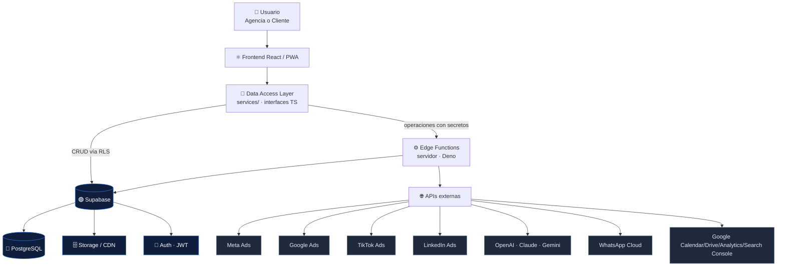

**Regla de oro de las dos capas:**

- **Capa 1 — Data Access Layer (cliente):** funciones puras (`createClient()`, `saveContent()`, `uploadMedia()`…). Ejecutan CRUD y queries directas a Supabase protegidas por RLS. Es el **único** código que importa `supabase-js`.
- **Capa 2 — Edge Functions (servidor):** todo lo que necesita **secretos** o cómputo pesado — llamar a Meta/Google/OpenAI, recibir webhooks, enviar correos, sincronizar métricas. Las llaves secretas **nunca** llegan al navegador.

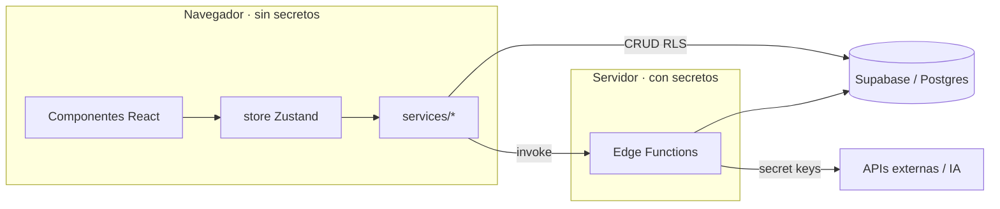

---

## 2. Arquitectura por módulos

Cada módulo declara su responsabilidad, tablas, servicios que consume/expone, APIs y eventos que emite.

| Módulo | Responsabilidad | Tablas principales | Servicios | APIs | Eventos que emite |
|---|---|---|---|---|---|
| **Dashboard Agencia** | KPIs globales del tenant | *(lecturas agregadas)* | `getAgencyDashboard()` | — | — |
| **Clientes** | Alta y gestión de clientes | `clients`, `user_clients` | `createClient`, `updateClient`, `archiveClient`, `inviteClient` | — | `client.created`, `client.archived`, `client.invited` |
| **Brief** | Información estratégica del cliente | `briefs` | `getBrief`, `saveBrief` | IA (sugerencias) | `brief.updated` |
| **Calendario** | Planificación mensual (vista) | `content_pieces`, `smart_events` | `getCalendar`, `planMonthAI`, `updatePiece` | IA (planificador) | `plan.generated` |
| **Cronopost** | Planificación editorial semanal | `content_pieces` | `getCronopost`, `swapPieces` | — | `piece.rescheduled` |
| **Multimedia** | Biblioteca visual + selección pauta | `content_pieces`, `content_files` | `uploadMedia`, `getMedia`, `selectForAds` | Storage | `media.uploaded`, `piece.selected_for_ads` |
| **Aprobaciones** | Flujo de revisión agencia↔cliente | `content_pieces`, `comments`, `approval_events` | `approvePiece`, `requestChanges`, `sendComment` | — | `piece.sent`, `piece.approved`, `piece.changes_requested` |
| **Campañas / Estrategia** | Centro de estrategia IA | `campaigns`, `content_pieces` | `getStrategy`, `saveCampaign` | IA (estrategia) | `campaign.created` |
| **Contrato** | Contrato maestro + firma | `contracts`, `contract_items`, `plan_templates` | `createContract`, `signContract` | — | `contract.signed` |
| **Pauta** | Vista ejecutiva de inversión (cliente) | `campaigns`, `ad_campaigns` | `getPautaSummary` | — | — |
| **Métricas** | Analítica unificada (cerebro) | `metric_snapshots`, `v_content_performance`, `ads`, `publications` | `getMetrics`, `getContentPerformance` | Meta/Google/TikTok/LinkedIn (sync) | `metrics.synced` |
| **Portal Cliente** | Misma data, permisos de cliente | *(todas, filtradas por RLS)* | *(reutiliza los servicios)* | — | — |
| **Administración** | Config de agencia, planes | `agencies`, `plan_templates`, `feature_flags` | `updateAgency`, `updatePlans` | — | — |
| **Usuarios / Roles** | Gestión de accesos | `users`, `user_clients`, `user_invitations` | `inviteUser`, `deactivateUser`, `assignRole` | Auth | `user.invited`, `user.deactivated` |
| **Notificaciones** | Avisos in-app/email/push | `notifications` | `notify`, `markRead` | Email/Push (Edge) | `notification.created` |

---

## 3. Modelo Entidad-Relación (ERD)

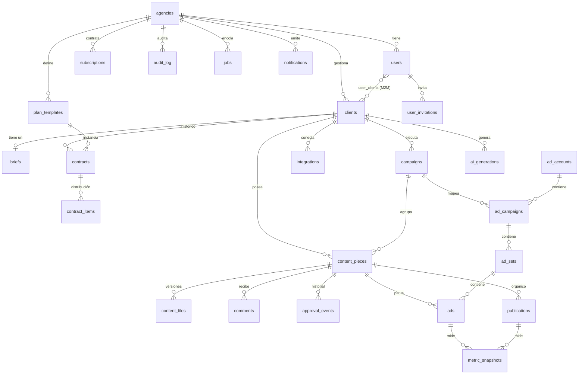

**Cardinalidades y claves clave:**

- `agencies (1) — (N) clients` — raíz del tenant. `agency_id` es `NOT NULL` y encabeza los índices.
- `users (M) — (N) clients` vía `user_clients` — un cliente con varios usuarios y un usuario con varias marcas.
- `clients (1) — (0..1) briefs` — un brief por cliente.
- `clients (1) — (N) contracts` — **histórico**: un cliente puede renovar; `es_vigente` marca el actual.
- `content_pieces (1) — (N) content_files` — versionado; `es_version_activa` marca la vigente.
- `ads (1) — (N) metric_snapshots` — **append-only**, particionable por fecha.
- **El vínculo estratégico:** `ads.content_piece_id` conecta cada anuncio con la pieza, su copy, hashtags y ángulo Andrómeda (congelados en snapshot al lanzar).

**Índices críticos** (todos con el tenant a la cabeza para aislamiento + rendimiento):

```
idx_pieces_client_fecha  (client_id, fecha_publicacion)
idx_pieces_estado        (client_id, estado)
idx_pieces_pauta         (client_id) WHERE seleccionado_pauta
idx_metrics_ad           (ad_id, snapshot_at)
idx_ads_piece            (content_piece_id)
idx_audit_agency         (agency_id, created_at)
idx_jobs_pendientes      (estado, programado_at) WHERE estado='pendiente'
```

> El detalle completo de tablas, tipos y constraints vive en [`docs/db/schema.sql`](db/schema.sql).

---

## 4. Flujo de datos — el corazón de FPlus

Toda la información se captura una vez y fluye entre módulos. Cada módulo alimenta al siguiente.

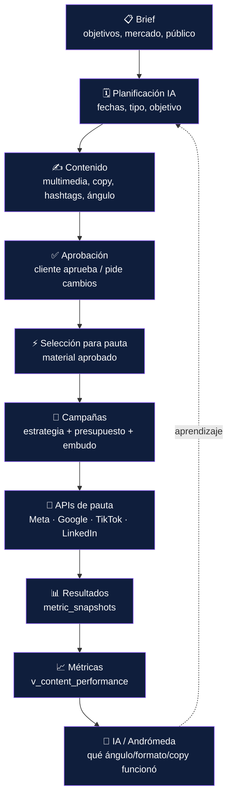

**El ciclo de aprendizaje:** las métricas reales (`metric_snapshots`) enriquecen a Andrómeda, que
mejora la próxima planificación. El planificador (`cronoplanner`) ya recibe el parámetro `historial`
preparado para esto. Así FPlus deja de ser un gestor y se convierte en un sistema que aprende.

**Flujo de aprobación (detalle):**

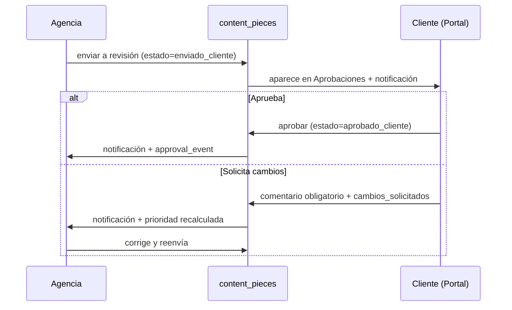

---

## 5. Estructura del proyecto

Estructura escalable pensada para años, no solo para hoy. Todo el código FPlus vive bajo `src/fplus/`
(regla existente: no se toca el núcleo de Evo CRM).

```
src/fplus/
├── modules/                 # Cada módulo autónomo (alta cohesión)
│   ├── clients/             #   components/ · hooks/ · types.ts
│   ├── brief/
│   ├── calendar/
│   ├── cronopost/
│   ├── multimedia/
│   ├── approvals/
│   ├── campaigns/
│   ├── contract/
│   ├── metrics/
│   └── portal/
├── services/                # 🧩 DATA ACCESS LAYER (única puerta a los datos)
│   ├── interfaces/          #   contratos TS: IClientService, IContentService…
│   ├── supabase/            #   implementación actual (importa supabase-js)
│   │   ├── clientService.ts
│   │   ├── contentService.ts
│   │   ├── mediaService.ts
│   │   └── authService.ts
│   ├── ai/                  #   IAService (OpenAI/Claude/Gemini intercambiables)
│   └── index.ts             #   factory: expone la implementación activa
├── store/                   # Zustand — llama a services/, nunca a supabase-js
├── components/              # UI compartida (ui/, layout/, modals/)
├── hooks/                   # hooks transversales
├── utils/                   # cronoplanner, copyGenerator, adStrategy, hashtagSuggester
├── types/                   # tipos globales (espejan el schema)
├── constants/               # planes, tipos, colores, mercados
├── config/                  # env, feature flags, clientes de proveedor
└── pages/                   # entrypoints y ruteo

backend/                     # (fuera del bundle del frontend)
├── edge-functions/          # ⚙️ CAPA 2 — Deno / Supabase Functions
│   ├── sync-meta/           #   sincroniza métricas de Meta Ads
│   ├── sync-google/
│   ├── ai-generate/         #   llama a OpenAI/Claude con secretos
│   ├── ingest-webhook/      #   recibe webhooks (Meta, Stripe…)
│   ├── send-email/          #   invitaciones, notificaciones
│   └── shared/              #   utilidades compartidas entre funciones
├── migrations/              # SQL versionado (Supabase CLI)
└── seeds/                   # datos semilla por ambiente

docs/
├── architecture.md          # este documento (Constitución Técnica)
└── db/schema.sql            # schema completo
```

**Principio de dependencia:** `pages → modules → store → services → (Supabase | Edge Functions)`.
Las flechas nunca van al revés. Un componente jamás importa `supabase-js`.

---

## 6. Convenciones

Una sola línea para todo el proyecto. No negociable.

### Base de datos
- **Tablas:** `snake_case`, **plural** (`content_pieces`, `ad_campaigns`).
- **Columnas:** `snake_case`, en español para dominio de negocio (`fecha_publicacion`, `estado`), en inglés para métricas estándar de API (`impressions`, `reach`, `clicks`) por compatibilidad 1:1 con los proveedores.
- **Claves primarias:** `id uuid default uuid_generate_v4()`. Excepción: tablas de altísimo volumen append-only (`audit_log`, `webhook_logs`) usan `bigint generated always as identity`.
- **Foreign keys:** `<entidad_singular>_id` (`client_id`, `content_piece_id`).
- **Timestamps:** `created_at`, `updated_at`, `deleted_at` (soft delete) — todos `timestamptz`.
- **Enums:** PostgreSQL `create type`, valores en `snake_case` (`content_state`, `integration_provider`).
- **IDs externos:** `external_<x>_id` + columna `provider` (par único).
- **Índices:** `idx_<tabla>_<columnas>`, siempre con `agency_id`/`client_id` a la cabeza.

### TypeScript / Frontend
- **Componentes:** `PascalCase` (`ClientWorkspace.tsx`). **Un componente por archivo.**
- **Hooks:** `camelCase` con prefijo `use` (`usePortalContext`).
- **Servicios:** `camelCase` verbo + entidad (`createClient`, `getBrief`, `uploadMedia`).
- **Interfaces de servicio:** `I` + PascalCase (`IClientService`).
- **Tipos:** `PascalCase` (`ContentPiece`, `AdStrategy`); espejan los nombres del schema.
- **Enums de dominio:** `type X = 'a' | 'b'` (unión de literales), no `enum`.
- **Carpetas:** `kebab-case` para features (`edge-functions/`), `camelCase` para archivos TS.

### APIs / Edge Functions
- **Endpoints/funciones:** verbo-recurso (`sync-meta`, `ai-generate`).
- **Respuestas:** `{ data, error }` — nunca lanzar; devolver error tipado.
- **Webhooks:** siempre verificar firma HMAC antes de procesar; loguear en `webhook_logs`.

---

## 7. Autenticación

Una sola aplicación, autenticación por roles vía **Supabase Auth** (emite JWT). La interfaz cambia
según el rol; agencia y cliente **nunca** son apps distintas.

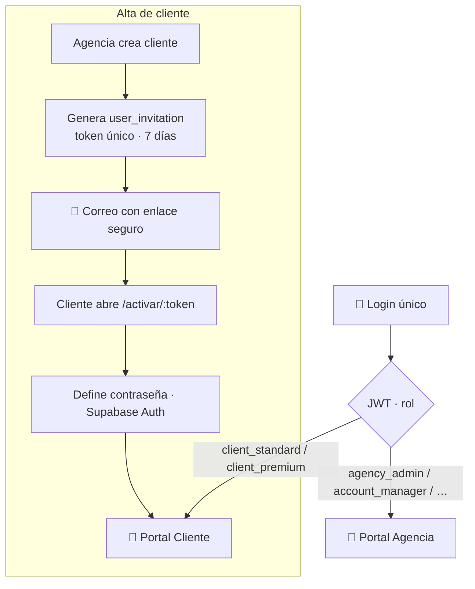

**Flujos documentados:**

| Flujo | Mecanismo |
|---|---|
| **Login agencia** | Email + contraseña → JWT con `rol` + `agency_id` como custom claims |
| **Login cliente** | Mismo login; JWT con `rol=client_*` + `client_id` → carga Portal Cliente |
| **Invitación** | `user_invitations` (token único, `expires_at` 7 días, `invited_by`) → correo automático (Edge Function) |
| **Activación** | `/activar/:token` valida el token, el cliente crea contraseña (Supabase Auth), se marca `accepted_at` |
| **Recuperación de contraseña** | Nativo de Supabase Auth (correo con enlace de reset) |
| **JWT** | Contiene `sub` (user id), `agency_id`, `rol`, `client_id?` como claims; lo consume RLS |
| **Roles** | 8 niveles: `super_admin`, `agency_admin`, `account_manager`, `media_buyer`, `content_manager`, `designer`, `client_standard`, `client_premium` |
| **Permisos** | Derivados del rol; se evalúan en RLS (datos) y en el frontend (UI) |
| **Desactivación** | `users.activo = false` — nunca se elimina; el historial queda intacto |

> En el entorno de pruebas actual (`VITE_FPLUS_DEMO`), el login es un placeholder (`admin/admin` para agencia; correo+contraseña de la invitación para cliente). Al montar Supabase Auth se reemplaza esa pantalla; **el resto del sistema no cambia**.

---

## 8. Arquitectura Multi-Tenant

Patrón: **base de datos compartida + `agency_id` en todo + Row Level Security**. El aislamiento lo
fuerza PostgreSQL a nivel de fila, no el frontend. Es el patrón estándar y escalable para miles de tenants
(no esquema-por-agencia ni base-por-agencia, que no escalan).

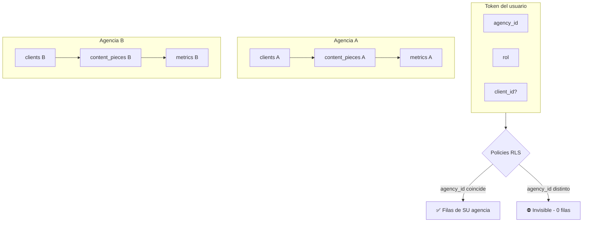

**Cómo funciona, paso a paso:**

1. Cada tabla de negocio tiene `agency_id NOT NULL`.
2. Al hacer login, Supabase Auth emite un **JWT** que incluye `agency_id` como *custom claim*.
3. Cada tabla tiene **RLS habilitado** y una policy que compara `agency_id` de la fila contra el claim del JWT:
   ```sql
   create policy agency_isolation on content_pieces
     using (agency_id = (auth.jwt() ->> 'agency_id')::uuid);
   ```
4. Resultado: una query de la Agencia A **físicamente no puede** devolver filas de la Agencia B, aunque el frontend tuviera un bug. La seguridad vive en la base.
5. **Cliente:** policy adicional que además restringe a su `client_id` y oculta `notas_internas` y `comments.interno`.

**Garantía:** nunca existe la posibilidad de que una agencia vea información de otra. El aislamiento es
estructural, no aplicativo.

---

## 9. Integraciones

Arquitectura genérica: **una tabla `integrations`** para todos los proveedores + **conectores
intercambiables** en Edge Functions. Conectar un proveedor nuevo = agregar un conector, sin tocar el núcleo.

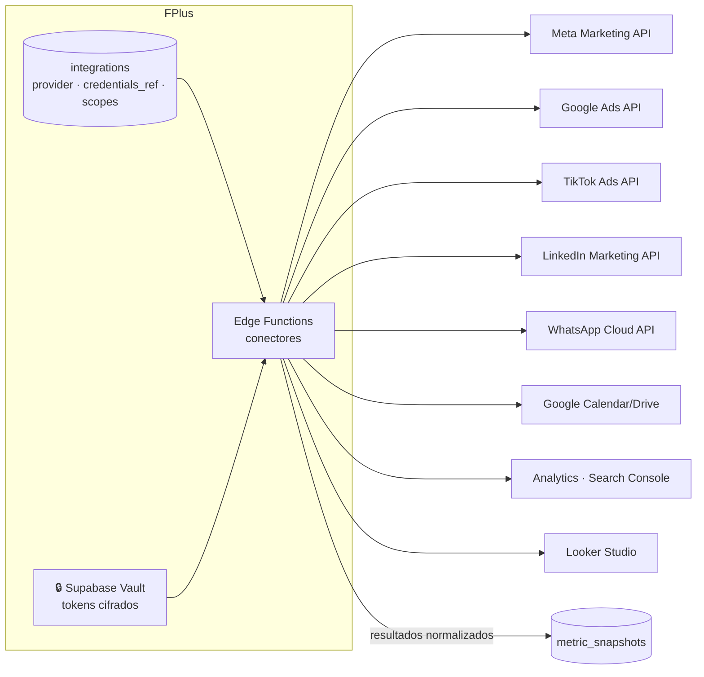

**Principios de integración:**

- **Credenciales:** siempre en **Supabase Vault** (cifradas), referenciadas por `credentials_ref`. Jamás en texto plano ni en el frontend.
- **Modelo unificado de métricas:** cada conector traduce el dialecto del proveedor a campos normalizados comunes (`impressions`, `reach`, `clicks`, `spend`, `leads`…). Lo que un proveedor no tenga → `NULL`. El payload crudo completo se guarda en `raw_data JSONB` (nada se pierde).
- **Derivados calculados, no almacenados:** CTR, CPC, CPM, ROAS se computan al consultar, con la misma fórmula para todas las fuentes → comparabilidad real.
- **Sincronización asíncrona:** vía `jobs` (cola). Un cron dispara `sync-meta`, `sync-google`… sin bloquear la app.
- **Webhooks entrantes:** verificados por firma HMAC y auditados en `webhook_logs`.

| Proveedor | Tipo | Uso en FPlus |
|---|---|---|
| Meta Marketing API | Ads | Métricas de campañas/anuncios de Instagram/Facebook |
| Google Ads API | Ads | Métricas de búsqueda/display/PMax |
| TikTok Ads API | Ads | Métricas de campañas TikTok |
| LinkedIn Marketing API | Ads | Métricas B2B |
| OpenAI / Claude / Gemini | IA | Copy, hashtags, estrategia (ver §10) |
| WhatsApp Cloud API | Mensajería | Notificaciones/aprobaciones futuras |
| Google Calendar/Drive | Productividad | Sincronización de calendario y archivos |
| Analytics / Search Console | Web | Atribución y tráfico |
| Looker Studio | BI | Exportación/embebido de reportes |

---

## 10. Inteligencia Artificial (Andrómeda)

La IA es multi-proveedor y desacoplada. La app llama a `IAService`; la implementación (OpenAI, Claude,
Gemini) se cambia sin tocar el resto. Cada generación se guarda para analítica y aprendizaje.

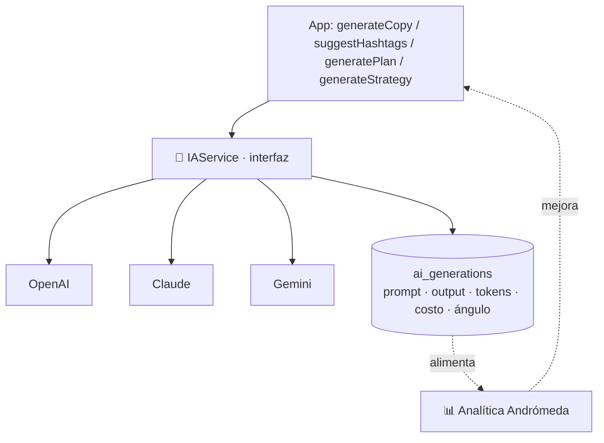

**Cómo funciona Andrómeda:**

- **Motores actuales (determinísticos, drop-in):** `copyGenerator` (hook/copy/CTA/ángulo), `hashtagSuggester`, `cronoplanner` (planificación), `adStrategy` (estrategia). Todos tienen firmas listas para que la IA real los reemplace **sin cambiar una línea de la app**.
- **Almacenamiento de prompts y respuestas:** tabla `ai_generations` — proveedor, modelo, tarea, `input` (prompt+variables), `output`, tokens, costo, latencia, y **`angulo_andromeda`** + referencia a la entidad (`entidad`, `entidad_id`).
- **Relación con el negocio:** cada generación se liga a su cliente, contenido, campaña o métrica. Combinado con `v_content_performance` responde: *¿qué ángulo de Andrómeda consiguió mejor CTR? ¿qué copy convirtió más?*
- **Cambio de proveedor sin tocar la app:** `IAService` es una interfaz; el frontend nunca sabe si detrás está OpenAI, Claude o Gemini. La llamada real ocurre en la Edge Function `ai-generate` (con la llave secreta en el servidor).
- **Aprendizaje continuo:** las métricas reales retroalimentan el `historial` del planificador → propuestas cada vez más personalizadas por cliente.

---

## 11. Storage

Los archivos pesados **nunca** van en la base de datos. Solo se guardan metadatos y una `object_key`.

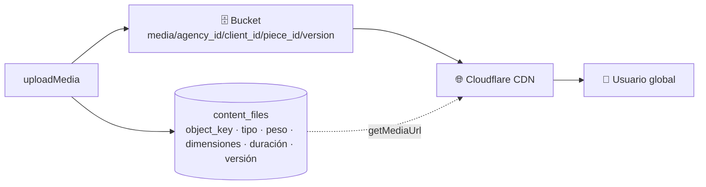

- **Buckets:** por tenant y entidad — `media/{agency_id}/{client_id}/{piece_id}/{version}`. Aislamiento reforzado por RLS de Storage.
- **Permisos:** RLS de Supabase Storage — un cliente solo accede a su material aprobado; la agencia a todo lo suyo.
- **En la base:** `content_files` guarda **solo** `object_key`, tipo, peso (`tamanio_bytes`), dimensiones, duración, estado, versión y relaciones. **Nunca la URL completa hardcodeada** — se resuelve en lectura vía `getMediaUrl(key)`.
- **Versionado:** cada subida es una fila nueva; `es_version_activa` marca la vigente. El historial de versiones queda intacto.
- **Previews/miniaturas:** generadas por Edge Function al subir (`thumbnail_path`); videos con poster.
- **Migración futura a Cloudflare R2:** como la base guarda solo `object_key` y la URL se resuelve en el DAL (`getMediaUrl`), migrar Supabase Storage → **R2** (egress $0) → S3 = cambiar el adaptador de storage. La base y las pantallas no se tocan. R2 se adopta cuando el volumen de egress lo justifique.

---

## 12. Seguridad

La seguridad nace con la plataforma, no se parcha después.

| Componente | Diseño |
|---|---|
| **Row Level Security** | Habilitado en todas las tablas de negocio; policies por `agency_id` (y `client_id` para portal) |
| **Roles** | 8 niveles en enum `user_role`; el rol viaja en el JWT |
| **Permisos** | Evaluados en RLS (datos) y en frontend (UI); un cliente nunca ve herramientas internas |
| **JWT** | Supabase Auth; claims `agency_id`, `rol`, `client_id` |
| **Vault** | Tokens de integraciones cifrados; referenciados por `credentials_ref` |
| **Variables de entorno** | `.env` por ambiente, fuera de git; secretos solo en el servidor (Edge Functions) |
| **Audit Log** | Tabla `audit_log` alimentada por **triggers** de PostgreSQL (`before`/`after` JSONB, actor, IP) — registro automático de todo cambio |
| **Soft Delete** | Columna `deleted_at` universal; nada se borra físicamente; queries/policies filtran `deleted_at IS NULL` |
| **Change log** | Cubierto por `audit_log` + `approval_events` (historial de estados de contenido) |
| **Webhooks** | Firma HMAC verificada antes de procesar; auditados en `webhook_logs` |
| **Backups** | Supabase Pro: diarios + PITR 7 días; + dumps lógicos programados a R2/S3 |
| **Recuperación** | Restauración probada en `staging` antes de cualquier acción en `prod` |
| **Logs** | `audit_log`, `webhook_logs`, `jobs` (errores), + logs de Edge Functions |

---

## 13. Ambientes

Tres ambientes aislados desde el inicio. Los desarrolladores nunca tocan datos reales.

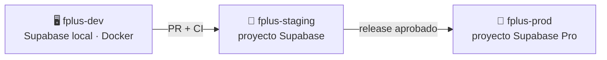

| Aspecto | Estrategia |
|---|---|
| **DEV** | Supabase local (Docker vía CLI). Base efímera, datos falsos. Migraciones se prueban aquí primero. |
| **STAGING** | Proyecto Supabase en la nube, espejo de prod. Validación previa al despliegue. |
| **PROD** | Proyecto Supabase Pro (`us-east-1`). Datos de clientes reales. |
| **Migraciones** | SQL versionado en git (`backend/migrations/`) vía Supabase CLI (`migration new`, `db push`). Nunca cambios a mano en prod. |
| **CI/CD** | GitHub Actions: corre migraciones en staging → tras aprobación, en prod. Frontend a Vercel por rama. |
| **Seeds** | `backend/seeds/` por ambiente (`seed.dev.sql`, `seed.staging.sql`). Prod sin datos de prueba. |
| **Variables de entorno** | `.env.development`, `.env.staging`, `.env.production` — fuera de git. Secretos en el gestor de secretos del proveedor. |
| **Backups** | Automáticos en Pro (diarios + PITR); dumps lógicos programados como respaldo extra. |
| **Restauración** | Runbook documentado; siempre ensayada en staging. |

---

## 14. Roadmap técnico

Orden técnicamente correcto: cada fase habilita la siguiente.

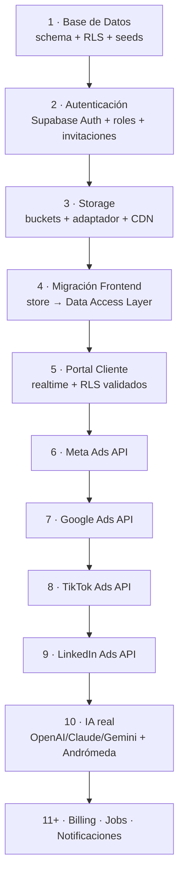

| Fase | Entregable | Depende de |
|---|---|---|
| **1. Base de Datos** | `schema.sql` ejecutado en Supabase + RLS + seed de los 5 clientes | — |
| **2. Autenticación** | Login real, roles, invitaciones por correo, recuperación de contraseña | Fase 1 |
| **3. Storage** | Buckets con RLS, `mediaService` con adaptador, CDN | Fase 1 |
| **4. Migración Frontend** | Acciones del store llaman al DAL (Supabase) en vez del mock | Fases 1-3 |
| **5. Portal Cliente** | Portal sobre datos reales con realtime | Fase 4 |
| **6-9. APIs de pauta** | Conectores Meta → Google → TikTok → LinkedIn escribiendo en `metric_snapshots` | Fase 4 |
| **10. IA real** | `IAService` con proveedores reales; `ai_generations` activo | Fase 4 |
| **11+. Plataforma** | Billing (Stripe), Jobs/Queue en producción, Notificaciones multicanal | Según demanda |

---

## 15. Arquitectura futura (escalamiento)

¿Sigue válida la arquitectura con 1.000 agencias, 30.000 clientes y millones de métricas? **Sí.**
PostgreSQL maneja miles de millones de filas. El crecimiento se absorbe con **evoluciones aditivas**,
no rediseños.

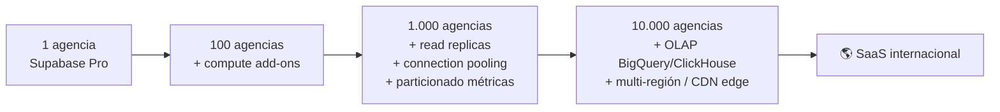

| Etapa | Qué crece | Cómo escala (aditivo, sin rediseño) |
|---|---|---|
| **1 → 100 agencias** | Carga de DB | Compute add-ons de Supabase (subir instancia) |
| **100 → 1.000** | Volumen de métricas y auditoría | **Particionar** `metric_snapshots`, `audit_log`, `webhook_logs` por fecha (ya diseñadas con `partition by range`); **read replicas** para reportes; **connection pooling** (Supavisor) |
| **1.000 → 10.000** | Analítica masiva | Camino **OLAP** separado (BigQuery/ClickHouse) alimentado desde Postgres; **CDN edge** global; réplicas multi-región |
| **Internacional** | Latencia global, cumplimiento | Réplicas de lectura regionales; SOC2 (Supabase Team/Enterprise); i18n |

**La única cosa que se diseña HOY para no sufrir después:** las tablas append-only de alto volumen
(`metric_snapshots`, `audit_log`, `webhook_logs`) ya están declaradas *listas para particionar*. La
partición real se activa cuando crezcan — es un cambio indoloro porque el diseño ya lo contempla.

**Qué NO cambia nunca:** el modelo de datos normalizado, la capa de servicios (DAL), el aislamiento
multi-tenant y los conectores desacoplados. Esa es la fundación permanente.

---

## 16. Componentes de plataforma

Mejoras incorporadas al diseño (schema v2) para que la base nazca preparada. **No se implementan aún**;
existen para no requerir migraciones estructurales en el futuro.

| Componente | Tabla(s) | Propósito |
|---|---|---|
| **Feature Flags** | `feature_flags` | Activar/desactivar funcionalidades por agencia o por plan (`ai_copy`, `whatsapp`, `metrics_v2`…) sin desplegar código |
| **Billing** | `subscription_plans`, `subscriptions`, `invoices`, `payments` | Suscripciones SaaS (integración Stripe futura); precios, facturas y pagos |
| **Jobs / Queue** | `jobs` | Procesos pesados asíncronos (sync Meta, IA, correos, métricas) sin bloquear la app; reintentos con backoff |
| **Webhook Logs** | `webhook_logs` | Registro y auditoría de todos los webhooks entrantes (Meta, Google, Stripe…); firma HMAC verificada |
| **Notificaciones** | `notifications` | Sistema unificado: in-app, email y push futuro, con un solo modelo (`canal`, `tipo`, `leida`) |

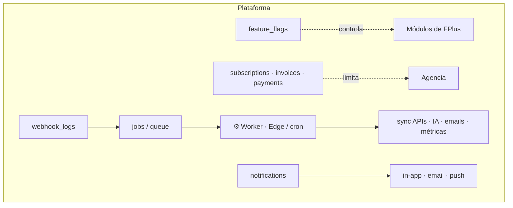

---

## Estado del documento

| | |
|---|---|
| **Versión** | 1.0 — Congelada |
| **Fecha** | 2026-07-04 |
| **Schema asociado** | [`docs/db/schema.sql`](db/schema.sql) — 32 tablas + 1 vista analítica |
| **Próximo paso** | Fase 1 del Roadmap: crear proyecto Supabase Pro (`us-east-1`) y ejecutar schema + RLS + seed |

> **Esta es la Constitución Técnica de FPlus.** Toda decisión futura debe respetarla. Cualquier cambio
> a la arquitectura se documenta aquí primero, se valida, y recién entonces se implementa.
