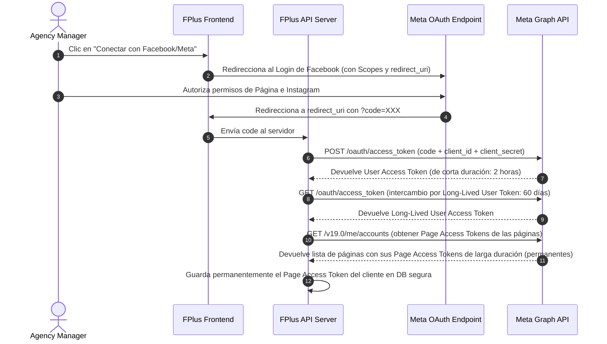

# Propuesta de Arquitectura: Integración con Meta API (Graph API & Lead Ads)

Este documento detalla el diseño técnico para conectar **FPlus AgencyOS** con la suite de APIs de Meta (Facebook e Instagram), con el fin de automatizar la ingesta de métricas de publicaciones, comentarios en tiempo real y leads atribuidos a campañas de pauta publicitaria.

---

## 1. Flujo de Autenticación y Autorización (OAuth 2.0)

Para consultar datos de las páginas e Instagram Business Accounts de los clientes, FPlus requiere un token de acceso autorizado con los alcances (scopes) correctos.

### Permisos Requeridos (Scopes):
- `pages_show_list` (Ver las páginas asociadas)
- `pages_read_engagement` (Leer métricas básicas e insights)
- `pages_manage_metadata` (Suscripción a webhooks de la página)
- `instagram_basic` (Acceso a perfiles comerciales de IG)
- `instagram_manage_insights` (Consultar métricas de Instagram)
- `ads_read` (Leer rendimiento de campañas de Meta Ads)
- `leads_retrieval` (Obtener información de leads captados)

### Flujo de Intercambio de Tokens:



---

## 2. Ingesta de Métricas y Rendimiento (Meta Insights Engine)

Las métricas orgánicas y de pauta se sincronizan diariamente mediante un proceso en segundo plano (Cron Job) que consulta la API de Graph.

### Modelo de Datos (Extensión de DB):

```sql
-- Conexión de Cuentas de Redes Sociales
CREATE TABLE social_connections (
    id UUID PRIMARY KEY DEFAULT gen_random_uuid(),
    client_id UUID REFERENCES clients(id) ON DELETE CASCADE,
    platform VARCHAR(50) NOT NULL, -- 'facebook', 'instagram', 'linkedin'
    external_account_id VARCHAR(255) NOT NULL,
    account_name VARCHAR(255) NOT NULL,
    access_token TEXT NOT NULL, -- Encriptado
    token_expires_at TIMESTAMP,
    created_at TIMESTAMP DEFAULT CURRENT_TIMESTAMP
);

-- Métricas Históricas
CREATE TABLE publication_insights (
    id UUID PRIMARY KEY DEFAULT gen_random_uuid(),
    publication_id UUID REFERENCES publications(id) ON DELETE CASCADE,
    reach INT DEFAULT 0,
    impressions INT DEFAULT 0,
    likes INT DEFAULT 0,
    comments INT DEFAULT 0,
    shares INT DEFAULT 0,
    saves INT DEFAULT 0,
    video_views INT DEFAULT 0,
    spend DECIMAL(10,2) DEFAULT 0.00,
    clicks INT DEFAULT 0,
    leads INT DEFAULT 0,
    engagement_rate DECIMAL(5,2) DEFAULT 0.00,
    snapshot_at TIMESTAMP NOT NULL,
    created_at TIMESTAMP DEFAULT CURRENT_TIMESTAMP
);
```

### Endpoints de Consulta:
1.  **Métricas de Posts en Instagram:**
    `GET /v19.0/{ig_media_id}/insights?metric=reach,impressions,engagement,saved,video_views`
2.  **Métricas de Posts en Facebook:**
    `GET /v19.0/{post_id}/insights?metric=post_impressions_unique,post_engaged_users,post_clicks_by_type_unique`
3.  **Métricas de Campañas de Pauta (Meta Ads):**
    `GET /v19.0/act_{ad_account_id}/insights?level=campaign&fields=campaign_name,spend,reach,impressions,clicks,actions`

---

## 3. Comentarios y Aprobación Activa (Webhooks)

Para lograr respuestas rápidas y no depender del polling, nos suscribimos al webhook en tiempo real de Meta.

### Configuración del Webhook:
*   **Objeto:** `page`
*   **Campos de suscripción:** `feed`, `mention`
*   **Comportamiento:**
    *   Cuando un cliente o seguidor comenta un post, Meta envía un POST al servidor de FPlus:
    ```json
    {
      "object": "page",
      "entry": [{
        "id": "PAGE_ID",
        "time": 1720800000,
        "changes": [{
          "field": "feed",
          "value": {
            "item": "comment",
            "verb": "add",
            "comment_id": "c_123456",
            "parent_id": "p_987654",
            "message": "Me encanta! ¿Cuál es el precio?",
            "sender_name": "Kinara Cliente"
          }
        }]
      }]
    }
    ```
    *   **Procesamiento:** El backend busca la publicación mediante `external_post_id`, genera una notificación push/mail para la agencia, y opcionalmente activa el agente de IA (**Andrómeda AI**) para sugerir una respuesta en el CRM.

---

## 4. Ingesta de Prospectos en Tiempo Real (Lead Ads Integration)

Para alimentar el dashboard de Leads del cliente y disparar automatizaciones de email marketing de inmediato.

### Flujo de Suscripción a Leads:
1.  **Suscripción a Webhook:** Suscripción al webhook `leadgen` del objeto `page`.
2.  **Consulta de Data de Lead:** Cuando llega el payload del webhook con el `leadgen_id`, el backend consulta:
    `GET /v19.0/{leadgen_id}`
    Con el Access Token del cliente para recuperar el email, teléfono e industria declarados en el formulario instantáneo.
3.  **Atribución:** El lead se asocia con el `campaign_id` y `utm_campaign` correspondiente de Meta Ads, calculando de forma exacta el **Costo por Lead (CPL)** en tiempo real.

---

## 5. Meta Publish Pipeline (Flujo de Publicación Automatizado)

El flujo de publicación está estructurado con validaciones previas para evitar rechazos o fallas en la API de Meta.

```
 [Contenido Aprobado por Cliente]
                 ↓
   [Validación 1: Estratégica]  --- (¿Alineado a pilares, objetivos y tono?)
                 ↓
     [Validación 2: Técnica]    --- (Formatos multimedia, límites de texto, tokens OAuth activos)
                 ↓
      [Cola de Publicación]     --- (Encolado asíncrono con BullMQ/Worker)
                 ↓
       [API Call de Meta]       --- (Publica en IG/FB y devuelve external_post_id)
                 ↓
      [Webhook de Confirmación] --- (Meta confirma post en vivo en su red)
                 ↓
    [Registro en Historial]     --- (Bitácora de auditoría guarda URL final de publicación)
                 ↓
    [Ingesta Diaria de Métricas] -- (Cron Job consulta insights cada 24 horas)
```

### Detalle de Validaciones Previas (Pre-flight Checks)
1.  **Validación Estratégica:**
    *   Verificación de que el pilar del contenido coincida con la campaña activa en el store.
    *   Chequeo de que la etapa del embudo de la pieza y la llamada a la acción (CTA) sean consistentes con el objetivo de conversión.
2.  **Validación Técnica:**
    *   **Imágenes:** Tipo MIME válido, tamaño máximo 8MB, relación de aspecto 4:5 o 1:1.
    *   **Videos:** Formato MP4/MOV, tasa de bits óptima, peso máximo 100MB, relación de aspecto 9:16 para Reels.
    *   **Textos:** Copys de Instagram no mayores a 2200 caracteres y con menos de 30 hashtags.
    *   **Tokens:** Verificación de validez y scopes del Page Access Token en base de datos.

---

## 6. Matriz de Sincronización Meta API

Para mantener la base de datos actualizada sin saturar los límites de peticiones (Rate Limits) de la Graph API de Meta, se adopta la siguiente matriz de periodicidad:

| Módulo / Datos | Frecuencia de Sincronización | Mecanismo de Entrada | Justificación Técnica |
| :--- | :--- | :--- | :--- |
| **Lead Ads** | Tiempo real | Webhook (`leadgen`) | Crítico para disparar de inmediato flujos de bienvenida y CRM en FPlus. |
| **Comentarios del Feed** | Tiempo real | Webhook (`feed` / `mention`) | Permite monitorear la reputación de la marca y alertar al Community Manager de inmediato. |
| **Mensajería (Inbox DMs)** | Tiempo real | Webhook (`messages`) | Habilita la bandeja de entrada conversacional interactiva y fluida. |
| **Métricas de Rendimiento (Insights)** | Cada 24 Horas | Worker Pull Batch | El alcance, impresiones y CTR de campañas de anuncios y posts acumulados no requieren tiempo real y se consolidan diariamente. |
| **Metadatos de Campañas (Ads API)** | Cada 24 Horas o Manual | Worker Pull Incremental | Sincroniza nombres de campaña, presupuestos y estados (activa/pausada). |

---

## 7. Regla de Desacoplamiento de Interfaz (Meta API UI Decoupling)

*   **Regla de Diseño:** Queda estrictamente prohibido que cualquier componente de la interfaz de usuario (React Components en Frontend) haga solicitudes HTTP directas a la API de Meta Graph o Ads API.
*   **Estructura de Flujo:**
    1.  La UI interactúa exclusivamente con el **Zustand Store** (despachando acciones o consultando estados locales).
    2.  Las solicitudes de red son delegadas a la capa de **Servicios/Repositorios** (ej. `src/fplus/services/metaService.ts`).
    3.  El servicio realiza la petición, formatea las respuestas de Meta y actualiza el Zustand Store.
    4.  El Store propaga los datos de vuelta a la UI mediante selectores de React, asegurando que la interfaz se mantenga desacoplada de la implementación de la API externa.
