# ARCHITECTURE_DIAGRAM · FPlus

> Diagramas en **Mermaid** (texto, no imágenes). Renderizan en GitHub. Reflejan el estado congelado (0001–0009).
> Nota: donde aparece ❌/bloqueo es el estado **actual** por ISSUE-001, no un fallo de diseño.

## 1 · Arquitectura general
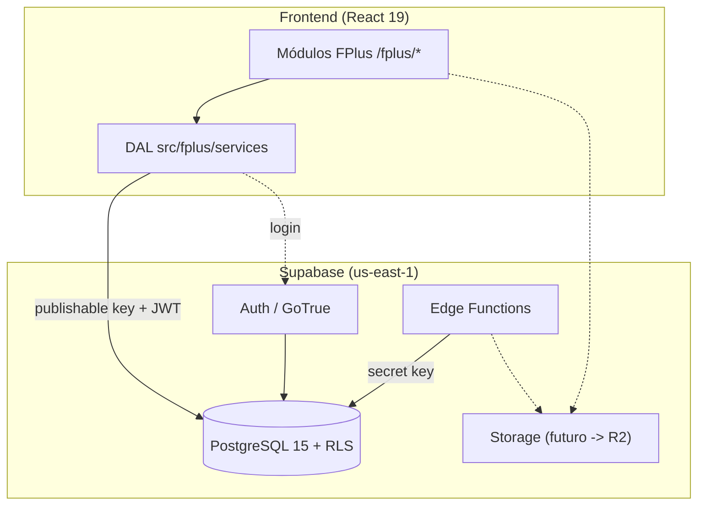

## 2 · Flujo de identidad (ADR-011)
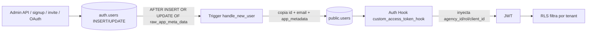

## 3 · Flujo DAL (ADR-004)
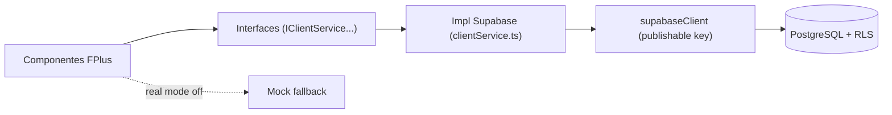

## 4 · Flujo RLS
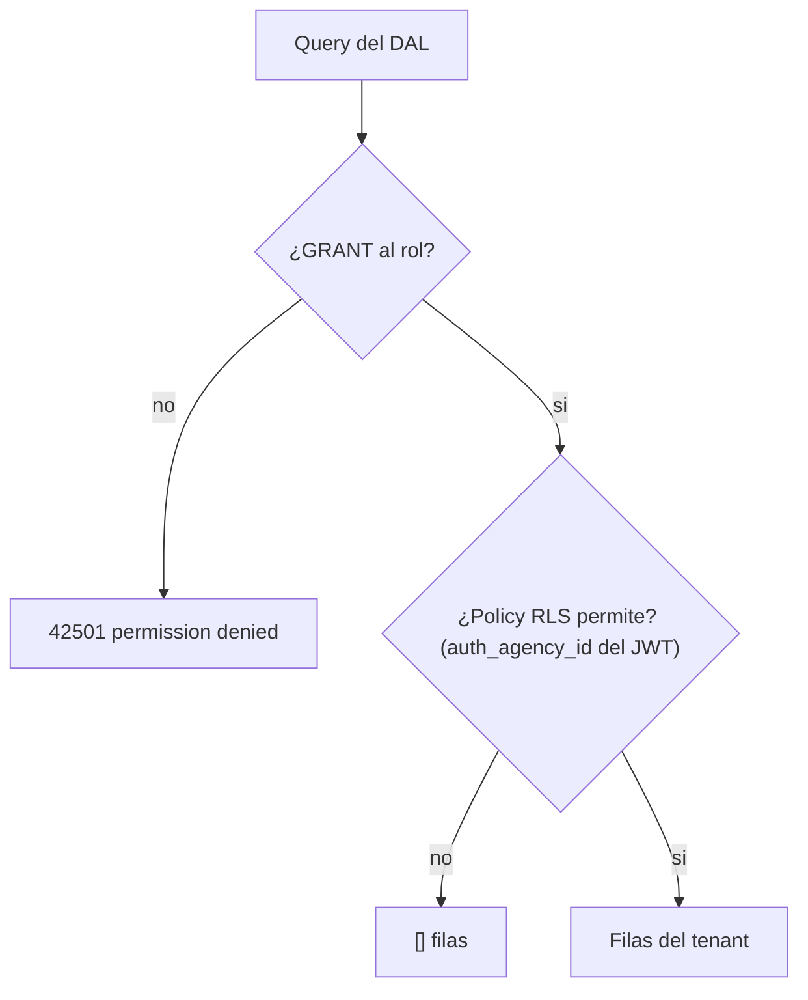

## 5 · Flujo Bootstrap (primer admin)
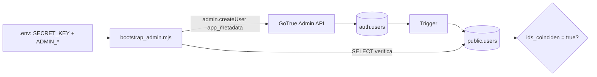

## 6 · Flujo Auth (login objetivo)
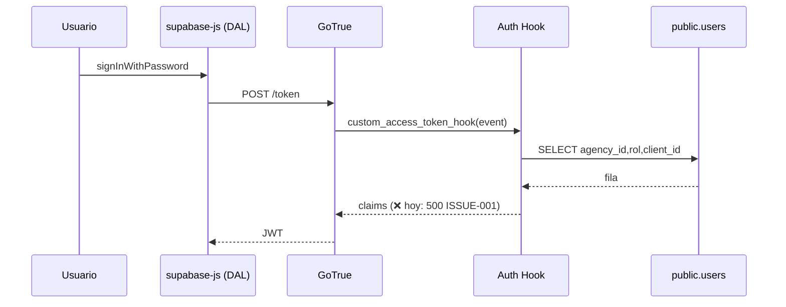

## 7 · Flujo Cliente (portal)
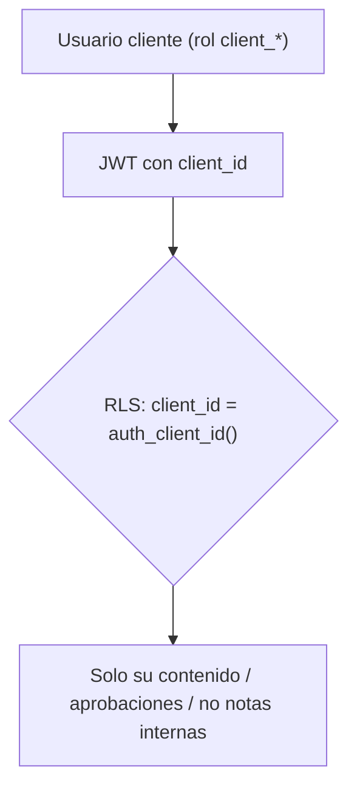

## 8 · Flujo Agencia
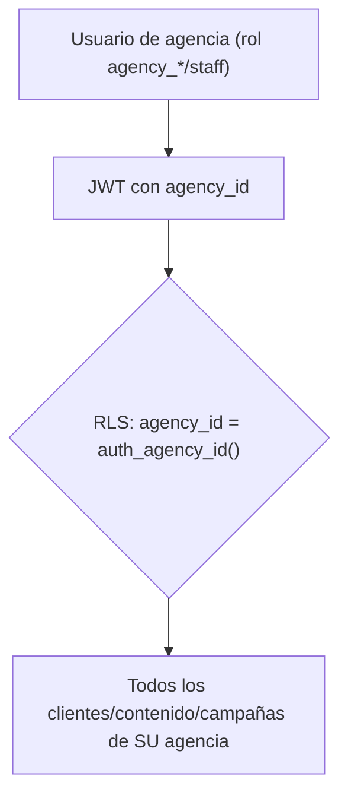

## 9 · Flujo Storage (futuro, ADR-009)
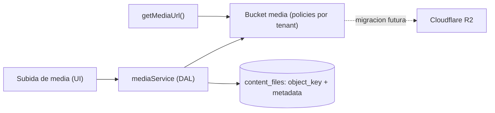

## 10 · Flujo Campañas (Centro de Estrategia)
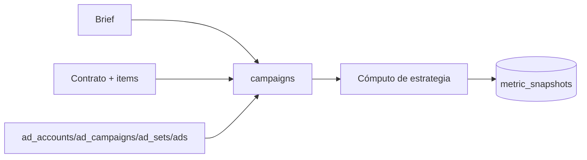

## 11 · Flujo de publicación
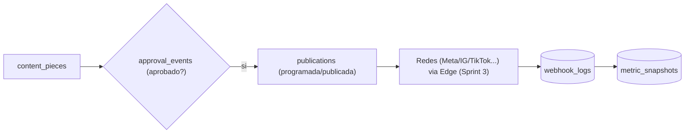
