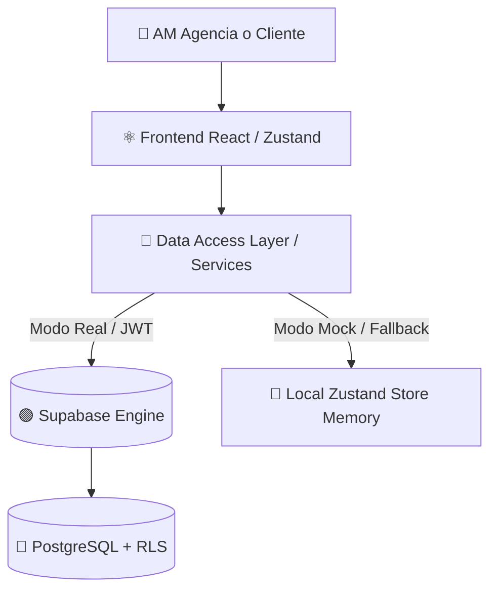

# FPlus / AgencyOS — Guía del Estado Estabilizado V1

Este documento representa la fuente oficial de verdad funcional y técnica de **FPlus / AgencyOS** en su hito **V1 Estabilizado**, sirviendo como puente de contexto para la transición a la siguiente fase de desarrollo de bases de datos y persistencia.

---

## 1. Visión General del Producto y Arquitectura

### ¿Qué es AgencyOS / FPlus?
Un **Marketing Operating System** (SaaS multi-tenant para agencias de marketing), diseñado e implementado como una capa `/fplus/*` sobre **Evo CRM Community**. El primer tenant piloto real del sistema es la agencia **Primero Digital**. El producto fue concebido por **Jamil Vera** como una plataforma SaaS robusta, escalable a 5-10 años.

### Arquitectura de Tres Capas
1.  **Frontend (React 19 + TypeScript + Zustand):** Interfaz premium y adaptativa. Los componentes no conocen al backend directo; leen y escriben a través de la capa de servicios (DAL) y el Store Zustand.
2.  **Data Access Layer (DAL):** Capa de servicios que actúa como puerto/adaptador, aislando las dependencias del navegador con Supabase. Actualmente opera con un **Mock Mode / Local Store Fallback** sumamente robusto para permitir iteraciones rápidas en caliente.
3.  **Base de Datos y Seguridad (Supabase/PostgreSQL 15):** Aislamiento Multi-Tenant configurado directamente a nivel de base de datos usando **Row Level Security (RLS)** y claims enriquecidos en el JWT del usuario (`agency_id`, `rol`, `fplus_client_id`).



---

## 2. Plan Personalizado y Visibilidad Dinámica
El Plan Personalizado define estructuralmente los servicios contratados por el cliente, sirviendo como la única fuente de verdad para la visibilidad de los módulos en todo AgencyOS:
*   **Servicios Identificables:** Gestión de Redes, Meta Ads, Google Ads, TikTok Ads, LinkedIn Ads, Landing Page, Desarrollo Web, SEO, entre otros.
*   **Visibilidad Dinámica de Módulos:**
    *   Un cliente **sin Gestión de Redes** (ej: solo Desarrollo Web) no ve Timeline orgánico, KPIs sociales ni módulos de contenido en su Dashboard. En su lugar, se renderiza una sección con barras de progreso técnicas del estado del Desarrollo Web/SEO.
    *   Un cliente **sin Pauta Publicitaria contratada** no ve el módulo de Campañas ni widgets de Métricas de anuncios, mostrándose un banner explicativo con la opción de solicitar la activación del Plan Premium.

---

## 3. Flujo Editorial y de Contenidos

### El Ciclo de Planificación
```
Brief del Cliente ➔ Motor Andrómeda AI ➔ Planificación Estratégica ➔ Cronopost (Semanal) / Calendario (Mensual) ➔ Multimedia ➔ Aprobación del Cliente ➔ Selección de Pauta ➔ Campañas
```

1.  **Brief Maestro:** Captura la información estratégica (tono de voz, pilares, presupuesto de marketing, competidores, plataformas).
2.  **Planificación (Andrómeda AI):**
    *   Genera de forma autónoma una propuesta de contenidos respetando la cantidad estricta de piezas pactada en el contrato (ej: si son 20 piezas mensuales, se crean exactamente 20 registros).
    *   Distribuye los copys y formatos coherentemente de lunes a sábado, reduciendo la prioridad y carga en domingos.
    *   Mapea formatos con coherencia estructural: *Reels* proponen ganchos/hooks visuales, *Carruseles* instancian esquemas de slides secuenciales y las *Historias* proponen stickers de interacción.
3.  **Cronopost & Calendario:**
    *   Vistas de planificación con reprogramación directa (Drag & Drop en Cronopost).
    *   **Bloqueo de Contenido Incompleto:** Se evalúan criterios de completitud (presencia de hook en Reels, slides en carrusel, hashtags, copy y archivos multimedia adjuntos). Si una pieza está incompleta, se deshabilita el botón de "Enviar a revisión".
4.  **Multimedia:** Biblioteca de recursos con almacenamiento local temporal. Al hacer clic en "Completar contenido" en Aprobaciones o en una tarjeta de Cronopost, se navega a la biblioteca con el parámetro `?edit=cpX` abriendo el modal de edición al instante.

---

## 4. Sistema de Campañas y Pauta

El módulo de Campañas actúa como el centro de pauta operativa para la agencia:
*   **Distribución del Presupuesto por Plataforma:**
    *   Se cumple estrictamente la regla: `SUMA DE DISTRIBUCIONES = PRESUPUESTO TOTAL`.
    *   **Auto-equilibrar (Activo):** Modificar el presupuesto de un canal ajusta proporcionalmente los demás para no violar la suma total.
    *   **Auto-equilibrar (Inactivo):** Permite escribir libremente. Un banner interactivo advierte en rojo si hay exceso, en amarillo si hay saldo restante, o en verde si está perfectamente equilibrado, bloqueando el guardado si se excede la suma.
    *   **Reconciliación Activa:** Si se añade/remueve un canal en el Brief, la distribución de presupuestos se ajusta eliminando o incorporando la clave del canal con saldo proporcional.
*   **Tabla Operativa (Spreadsheet Layout):**
    *   Nomenclatura jerárquica en 3 niveles (*Campaña*, *Conjunto de Anuncios*, *Anuncio*) propuesta por el sistema y completamente editable.
    *   Campos editables: *Campaña*, *Conjunto*, *Anuncio*, *Segmentación*, *Presupuesto*, *Comentarios*.
    *   Vínculo con Creativos: Dropdown interactivo que conecta la fila con un material marcado para pauta desde Multimedia, mostrando su formato y badge en miniatura.
    *   Soporte para agregar filas y columnas personalizadas dinámicas que persisten en la sesión del cliente.

---

## 5. Proveedor de Métricas Coherentes (Simuladas)
Hasta la integración real con las APIs de Meta Ads, Google Ads y TikTok Ads en el Sprint 3:
*   **metricsProvider.ts:** Provee un dataset simulado determinista basado en el ID de cada cliente (`cl3`, `cl1`, etc.) y el presupuesto asignado.
*   **Consistencia Absoluta:** Garantiza que tanto la vista de la Agencia como el Portal del Cliente reporten exactamente los mismos KPIs de clics, leads, CPM, CTR, ROAS e inversión para el mismo periodo.
*   **Desacoplamiento:** Los datos demo de rendimiento no contaminan en ningún momento los timelines reales de Cronopost, comentarios de aprobación, notificaciones ni el historial de auditoría.

---

## 6. Experiencia del Portal Cliente (Aprobaciones Limpias)

El Portal Cliente prioriza la simplicidad y el flujo de revisión:
*   **Jerarquía de Inicio:** La tarjeta de "Avance del mes" encabeza el portal con alta prioridad visual, seguida por los KPIs y las publicaciones del timeline.
*   **Notificaciones Interactiva:** Una campana interactiva en el header alerta al cliente sobre nuevos contenidos pendientes de aprobación y al account manager de la agencia sobre comentarios o aprobaciones de piezas.
*   **Detalle de Contenido Simplificado (`isClientView={true}`):** Al abrir la vista detallada de aprobación, se ocultan del mockup los metadatos estratégicos internos como *Etapa de embudo*, *Objetivo de marketing*, *CTA independiente* y la *Justificación Algorítmica de Andrómeda AI* para evitar la saturación visual del cliente, manteniendo solo lo esencial para su revisión (Multimedia, Copy, Hashtags, Formato, Fecha Programada y botones de decisión).

---

## 7. Diferencias entre Escenarios: Cliente Nuevo vs Historial

*   **Cliente Nuevo (cl2):** Empieza con un estado verdaderamente limpio. No muestra publicaciones históricas de ejemplo, timelines con fechas del mes anterior, actividad de auditoría ficticia, ni notificaciones de aprobación de periodos previos.
*   **Cliente con Historial (cl3):** Mantiene y despliega su timeline de publicaciones previas ("publicadas"), comentarios archivados, métricas acumuladas consistentes por fecha, e historial de eventos de auditoría.

---

## 8. Adaptabilidad Responsive y Diseño Visual

*   **Diseño Premium:** Colores oscuros coordinados, tipografía moderna, degradados fluidos en mockups y animaciones sutiles (efecto de disco giratorio en Reels de video).
*   **Criterio de Adaptabilidad:**
    *   **Desktop (1920x1080, 1440x900, 1366x768):** Layout a doble columna en Workspace, barras laterales y grillas de campañas totalmente desplegadas aprovechando el ancho.
    *   **Tablet (1024x768, 768x1024):** Sidebar colapsable automático, grids sociales se reestructuran a una o dos columnas para evitar recortes.
    *   **Móvil (430x932, 390x844, 375x812, 360x800):** Menú hamburguesa superior, botones flotantes de acción principal de fácil alcance táctil, scrolls horizontales controlados y tablas operativas responsivas que adaptan sus celdas para evitar desbordamientos.

---

## 9. Estado de Integración de Supabase (Actual)

*   **Migraciones Aplicadas:** Migraciones oficiales `0001` a `0009` más `0011_namespace_client_id` (que renombra la claim JWT a `fplus_client_id` resolviendo el ISSUE-001 de colisión de GoTrue). La migración experimental `0010` fue formalmente descartada.
*   **Verificación Local (PGlite):** Toda la suite de pruebas de bases de datos (`test_migrations.mjs`, `test_clientes_dal_auth.mjs`) compila y se ejecuta en verde usando el motor virtual PGlite local, stubbeando la infraestructura sin dependencias del servidor en línea.

---

## 10. Instrucciones de Arranque y Build

### Ejecución en Desarrollo
```bash
# Variables de entorno requeridas en .env.local
VITE_FPLUS_DEMO=true

# Levantar servidor
npm run dev
```

### Compilación para Producción
```bash
# Valida TypeScript estricto y empaqueta bundle con Vite
npm run build
```

---

## 11. Siguiente Fase del Proyecto

*   **Conexión Real del DAL a Base de Datos:** Migrar del fallback del store en Zustand local hacia lecturas y escrituras directas sobre Supabase usando la Publishable Key y JWT.
*   **Implementación de Políticas RLS Multi-Tenant:** Habilitar y validar el aislamiento en Supabase para asegurar que un cliente o agencia no pueda leer ni escribir datos pertenecientes a otra organización.
*   **Integración de Storage:** Configurar Supabase Storage Buckets para persistir los archivos multimedia reales cargados por los Community Managers de la agencia.
