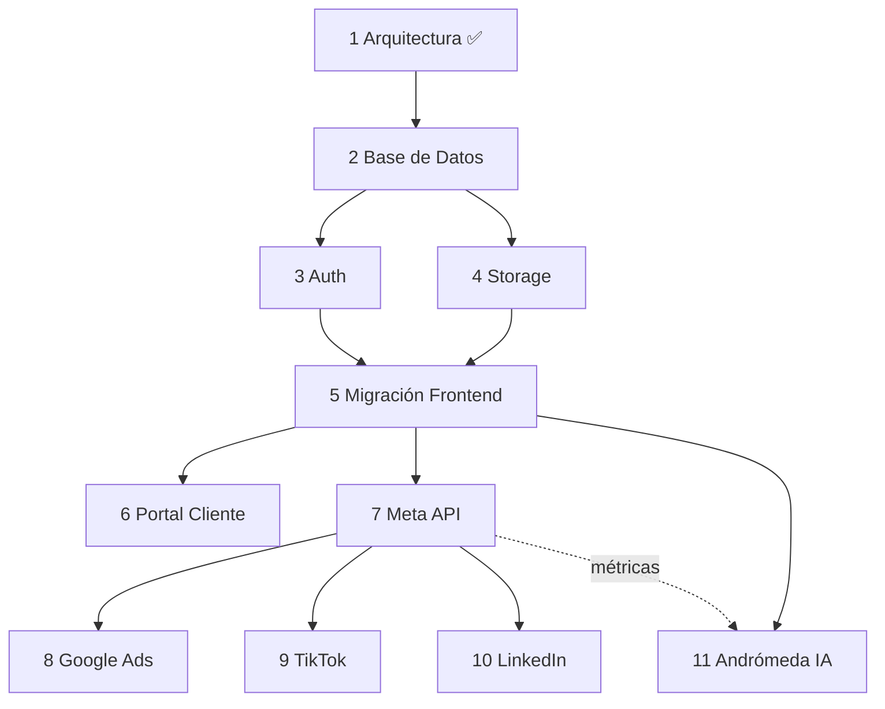

# FPlus — Roadmap Técnico (Congelado)

Fases oficiales del proyecto, en orden técnicamente correcto: cada fase habilita la siguiente. Este roadmap
está **congelado** junto con la [Arquitectura v1.0](architecture.md). El orden no se altera sin justificación
técnica documentada.

**Leyenda de estado:** ✅ Completado · 🔵 En curso · ⬜ Pendiente

---

## Fase 1 — Arquitectura

- **Objetivo:** definir y congelar la arquitectura completa del producto.
- **Dependencias:** ninguna.
- **Resultado esperado:** Constitución Técnica, schema, ADRs, roadmap, backlog y principios documentados y aprobados.
- **Estado:** ✅ Completado

## Fase 2 — Base de Datos

- **Objetivo:** crear el proyecto Supabase y ejecutar el schema completo con RLS y datos semilla.
- **Dependencias:** Fase 1.
- **Resultado esperado:** proyecto Supabase Pro en `us-east-1`, 32 tablas creadas, policies de RLS activas, seed de los clientes de prueba, migraciones versionadas.
- **Estado:** ⬜ Pendiente

## Fase 3 — Autenticación

- **Objetivo:** login real por roles, invitaciones por correo, recuperación de contraseña, activación.
- **Dependencias:** Fase 2.
- **Resultado esperado:** Supabase Auth emitiendo JWT con `agency_id` y `rol`; flujo de invitación/activación del cliente funcionando sobre datos reales; RLS consumiendo los claims.
- **Estado:** ⬜ Pendiente

## Fase 4 — Storage

- **Objetivo:** almacenamiento de multimedia con permisos y CDN.
- **Dependencias:** Fase 2.
- **Resultado esperado:** buckets con RLS, `mediaService` con adaptador (Supabase→R2), generación de miniaturas, CDN delante; la base guarda solo `object_key` + metadata.
- **Estado:** ⬜ Pendiente

## Fase 5 — Migración del Frontend

- **Objetivo:** conectar la app real a la base de datos a través del Data Access Layer.
- **Dependencias:** Fases 2, 3, 4.
- **Resultado esperado:** las acciones del store llaman al DAL (Supabase) en vez del mock; adiós a localStorage; las pantallas no cambian.
- **Estado:** ⬜ Pendiente

## Fase 6 — Portal Cliente

- **Objetivo:** portal del cliente sobre datos reales, con tiempo real.
- **Dependencias:** Fase 5.
- **Resultado esperado:** portal validado con RLS (cliente ve solo lo suyo, sin datos internos) y realtime (aprobaciones/comentarios en vivo).
- **Estado:** ⬜ Pendiente

## Fase 7 — Meta Marketing API

- **Objetivo:** primer conector de pauta; sincronizar métricas de Meta.
- **Dependencias:** Fase 5.
- **Resultado esperado:** conector en Edge Function que autentica, sincroniza y normaliza métricas de Meta hacia `metric_snapshots`, vinculadas a `ads.content_piece_id`.
- **Estado:** ⬜ Pendiente

## Fase 8 — Google Ads API

- **Objetivo:** segundo conector, mismo modelo unificado.
- **Dependencias:** Fase 7 (patrón de conector establecido).
- **Resultado esperado:** métricas de Google normalizadas en `metric_snapshots`; el módulo Métricas las muestra junto a Meta sin cambios.
- **Estado:** ⬜ Pendiente

## Fase 9 — TikTok Ads API

- **Objetivo:** tercer conector.
- **Dependencias:** Fase 7.
- **Resultado esperado:** métricas de TikTok integradas al modelo común.
- **Estado:** ⬜ Pendiente

## Fase 10 — LinkedIn Ads API

- **Objetivo:** cuarto conector.
- **Dependencias:** Fase 7.
- **Resultado esperado:** métricas de LinkedIn (B2B) integradas al modelo común.
- **Estado:** ⬜ Pendiente

## Fase 11 — Andrómeda IA

- **Objetivo:** IA real multi-proveedor y aprendizaje continuo.
- **Dependencias:** Fase 5 (datos) + Fases 7-10 (métricas históricas).
- **Resultado esperado:** `IAService` con OpenAI/Claude/Gemini reales; `ai_generations` registrando cada generación; el planificador consumiendo `historial` de métricas para propuestas personalizadas por cliente.
- **Estado:** ⬜ Pendiente

---

## Después del roadmap principal

Componentes de plataforma que se activan según demanda (ver [backlog](backlog.md) y §16 de la Constitución):
Billing (Stripe), Jobs/Queue en producción, Notificaciones multicanal, Observabilidad.

## Dependencias visuales

